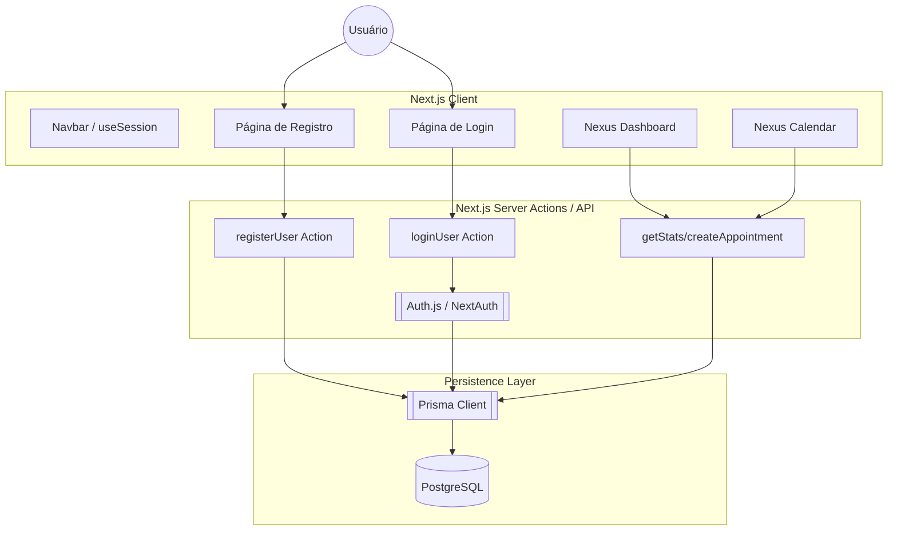

# Arquitetura do Sistema - Smart Booking (v2)

Este documento descreve a nova arquitetura do sistema após a migração do Supabase para **Prisma + Auth.js**.

## Visão Geral

O sistema utiliza **Next.js 15+** com a arquitetura de **App Router** e **Server Actions**. A camada de dados é gerenciada pelo **Prisma ORM**, conectando-se a um banco de dados PostgreSQL persistente (Neon/Vercel).

## Fluxo de Autenticação e Dados

## Modelos de Dados (Prisma)

- **User**: Informações do usuário e autenticação.
- **Account/Session**: Gerenciamento de tokens e sessões do Auth.js.
- **Service**: Catálogo de serviços disponíveis para agendamento.
- **Appointment**: Registro de agendamentos entre Profissionais e Clientes.

## Vantagens da Nova Arquitetura

1.  **Resiliência**: Banco de dados não "pausa" por inatividade (cold start rápido).
2.  **Segurança**: Senhas criptografadas com `bcryptjs` e sessões gerenciadas por JWT seguro.
3.  **Performance**: Consultas otimizadas via Prisma Singleton.
4.  **Manutenibilidade**: Código tipado de ponta a ponta com TypeScript.
