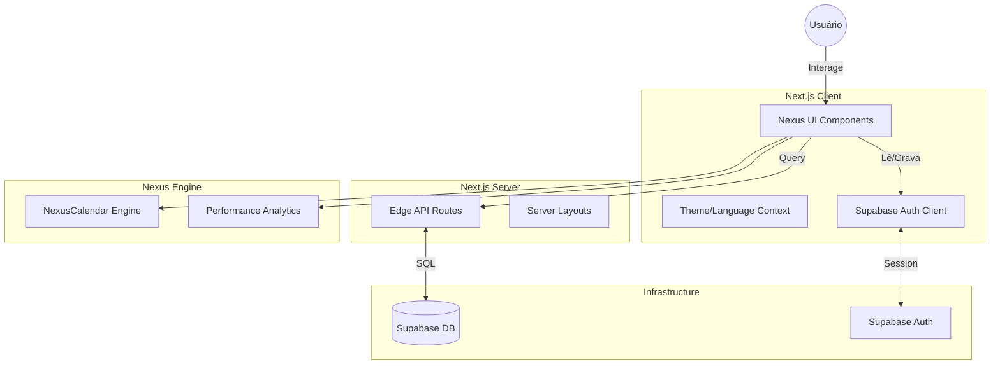
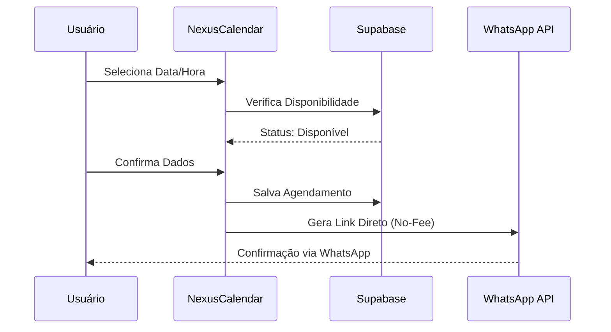

# Arquitetura do Sistema: Smart Booking (Nexus)

Este documento detalha a arquitetura técnica, fluxo de dados e estrutura de componentes do ecossistema Nexus.

## Visão Geral Técnica

Nexus é uma plataforma de agendamento de alta performance construída com tecnologias modernas de 2026, focada em velocidade, design minimalista (Absolute) e integração resiliente.

### Tech Stack
- **Frontend:** Next.js 15 (App Router), React 19.
- **Styling:** Tailwind CSS v4 (Modern Engine).
- **Componentes:** Radix UI (Unstyled primitives).
- **Backend-as-a-Service:** Supabase (PostgreSQL, Auth).
- **Icons:** Lucide-React.

## Diagrama de Arquitetura

## Fluxo de Agendamento

## Estrutura de Diretórios
- `src/app/`: Rotas e layouts do sistema.
- `src/components/nexus/`: Componentes core da engine Nexus.
- `src/components/ui/`: Primitivas de interface (shadcn-like).
- `src/lib/`: Utilitários, configurações do Supabase e hooks customizados.
